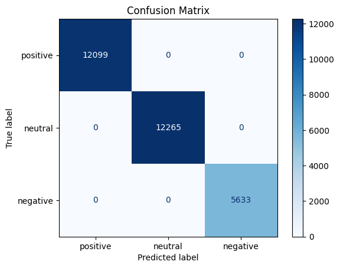
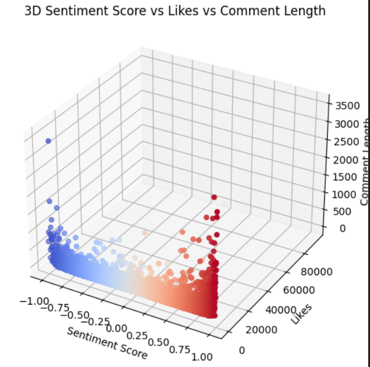

# ⚡ EV Sentiment Analysis: YouTube & Reddit Comments


> **Analyze public sentiment and sarcasm in Electric Vehicle (EV) discussions using advanced deep learning and real-time data extraction from YouTube & Reddit.**

---

## 🚀 Project Overview

This project focuses on Sentiment Analysis and Sarcasm Detection of Electric Vehicle (EV) reviews across YouTube and Reddit. It classifies comments as positive, neutral, or negative, and identifies sarcastic remarks. Real-time data extraction, model training, and insightful visualizations are core aspects.

We compare state-of-the-art models including RoBERTa, BERT, BiLSTM, and a Hybrid Model (RoBERTa + Attention + BiLSTM), and analyze results across two datasets, including sarcasm and emotion detection.

---

## 📋 Table of Contents

- [Project Overview](#project-overview)
- [Features](#features)
- [Datasets](#datasets)
- [Installation](#installation)
- [Usage](#usage)
- [Folder Structure](#folder-structure)
- [Results](#results)
- [Contributing](#contributing)
- [License](#license)
- [Acknowledgements](#acknowledgements)

---

## 🌟 Features

- **Real-time Data Extraction**: Grabs YouTube and Reddit comments using APIs.
- **Model Comparison**: Benchmarks RoBERTa, BERT, BiLSTM, and a Hybrid Model.
- **Sarcasm Detection**: Flags sarcastic comments.
- **Sentiment Analysis**: Classifies comments as positive, neutral, or negative.
- **Emotion Analysis**: Detects emotions such as joy, anger, surprise, etc.
- **Data Visualizations**: Generates confusion matrices, word clouds, sentiment plots, and more.

---

## 📊 Datasets

### Data Overview

- **video_id**: Unique ID (YouTube only)
- **comment**: Comment text
- **time**: Timestamp
- **likes**: Number of likes
- **sentiment**: Predicted sentiment (positive, neutral, negative)
- **sentiment_score**: Sentiment as a number
- **green_tag**: EV/green-tech relevance
- **sarcasm**: Boolean for sarcasm
- **label**: Sentiment label (0, 1, 2)
- **emotion**: Detected emotion

### Data Extraction

#### YouTube (Google API)
```python
from googleapiclient.discovery import build
def fetch_youtube_comments(video_id, api_key):
    youtube = build('youtube', 'v3', developerKey=api_key)
    comments = []
    results = youtube.commentThreads().list(part='snippet', videoId=video_id, textFormat='plainText').execute()
    for item in results['items']:
        comment = item['snippet']['topLevelComment']['snippet']['textDisplay']
        comments.append(comment)
    return comments
```

#### Reddit (PRAW)
```python
import praw
def fetch_reddit_comments(subreddit_name):
    reddit = praw.Reddit(client_id='YOUR_CLIENT_ID', client_secret='YOUR_CLIENT_SECRET', user_agent='YOUR_USER_AGENT')
    subreddit = reddit.subreddit(subreddit_name)
    comments = [comment.body for comment in subreddit.top(limit=100)]
    return comments
```

---

## ⚙️ Installation

1. **Clone the Repository**
   ```bash
   git clone https://github.com/ShreyaVerma0407/EV-Sentiment-Analysis.git
   cd EV-Sentiment-Analysis
   ```

2. **(Recommended) Create a Virtual Environment**
   ```bash
   python -m venv venv
   source venv/bin/activate     # On Windows: venv\Scripts\activate
   ```

3. **Install Requirements**
   ```bash
   pip install -r requirements.txt
   ```
   *(Includes: transformers, pandas, matplotlib, seaborn, sklearn, etc.)*

4. **Configure API Keys**
   - Update the scripts in the Data/ folder with your YouTube and Reddit API credentials.

---

## 🏃 Usage

- **Collect Data:** Run scripts in `Data/` to extract and preprocess comments.
- **Train Models:** Use scripts in `Models/` or notebooks in `Notebooks/` for training/evaluation.
- **Visualize Results:** Generate plots via:
   ```bash
   python Visualisations/visualisations.py
   ```
- **Review Outputs:** All results and visualizations are stored in `Output/`.

---

## 📁 Folder Structure

```plaintext
ev-sentiment-analysis/
├── Data/
│   └── Datasets/
│       ├── ev_ytcomments.csv       # YouTube dataset
│       └── ev_redditcomments.csv   # Reddit dataset
├── Models/
│   ├── RoBERTa/
│   ├── BERT/
│   ├── BiLSTM/
│   └── HybridModel/
├── Visualisations/
│   └── visualisations.py
├── Output/                  # Prediction results, plots, metrics
├── requirements.txt
└── README.md
```

---

## 📈 Results

### Model Comparison

| Model         | YouTube Accuracy | Reddit Accuracy |
|---------------|------------------|-----------------|
| RoBERTa       | 95%              |                 |
| BERT          | 95%              |                 |
| BiLSTM        | 54%              |                 |
| Hybrid Model  | **97%**          | **92%**         |

**Hybrid Model (RoBERTa + Attention + BiLSTM) outperformed all other models.**

### Visual Comparisons

Confusion Matrix & Sentiment Distribution (see Output/ for plots):




---

## 🤝 Contributing

1. Fork the repository
2. Create a new branch
3. Make changes and add tests if needed
4. Commit and submit a pull request

---

## 📝 License

This project is licensed under the MIT License - see the LICENSE file for details.

---

## 🙏 Acknowledgements

- **Hugging Face**: For providing powerful RoBERTa and BERT models.
- **scikit-learn**: For their comprehensive machine learning tools and evaluation metrics.
- **Pandas**: For efficient data handling and manipulation.
- **Reddit API (PRAW)**: For enabling the scraping of comments from Reddit.
- **YouTube API**: For enabling the extraction of comments and data from YouTube videos.


---

*For more examples and details, see module-level READMEs and code comments.*
